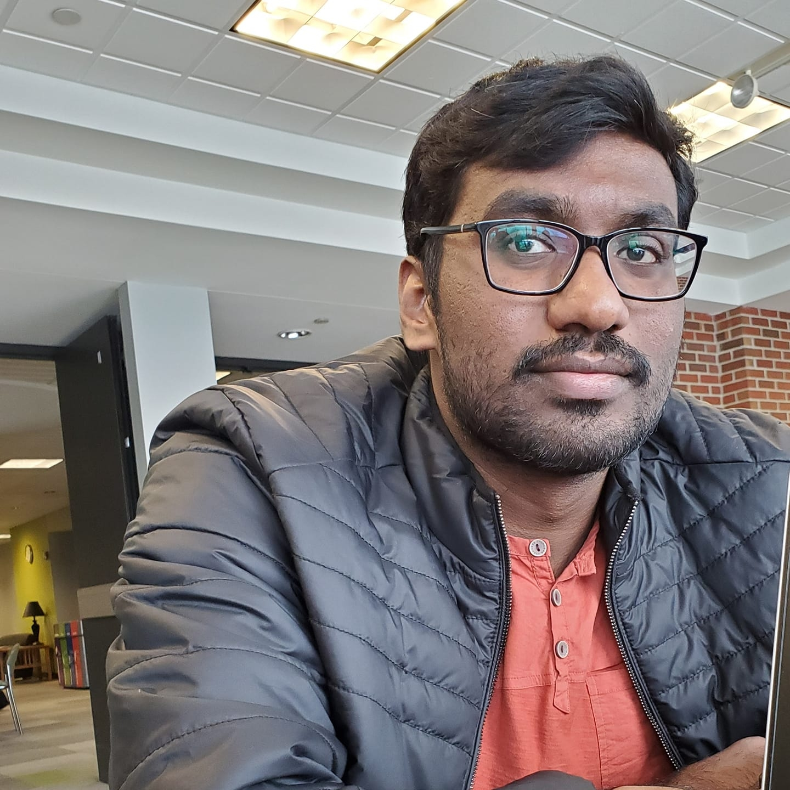

# big-data-dev
This is a big data developer app

# Puneeth

## Current

I am in the last semester of my Masters in Applied Computer Science in Northwest Missouri State University. We have courses like Big data, GDP II. I have also done part-time job in the campus.

## Background

I am from Warangal district of Telangana state, India. I did my schooling in Tejaswi Concept School in Warangal. I completed my intermediate in Narayana Junior College in Hyderabad. I pursued my undergraduation in Electronics and Communication Engineering in Gitam, Deemed to be University, hyderabad. My hobbies are watching and playing cricket, listening to music for relaxation.

## Plans

I am thinking to work on SAP or Devops. But looking at present market situation, I would like to learn any technology and enter into IT industry.

## Links

- [Linkedin](https://www.linkedin.com/in/puneeth-annam-921b7219a/)

- [Github](https://github.com/Puneeth159)

- [Bitbucket](https://bitbucket.org/Puneethannam/)

[Shell data processing repo link](https://github.com/Puneeth159/shell-data-processing)
